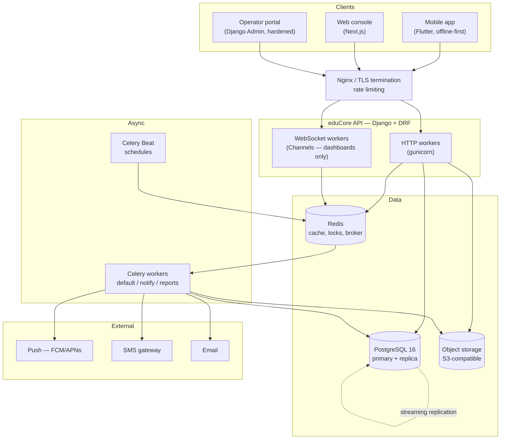
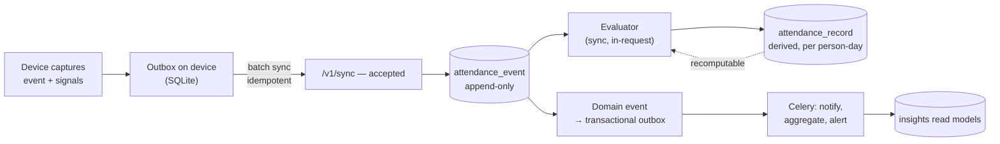

# 02 — Architecture

## Shape

A **modular monolith** (Django) with asynchronous workers (Celery), fronted by an
API gateway, serving a web console and mobile clients.
See [ADR-0005](adr/0005-modular-monolith.md) for why not microservices.



## Module boundaries

Each module is a Django app. Modules communicate through **service functions and
domain events**, never by reaching into another module's models. Enforced by
import-linter in CI — a violation fails the build.

```
core/          tenancy, users, memberships, RBAC, audit, outbox, signed tokens
academics/     years, terms, levels, class groups, departments, subjects, courses
timetable/     rooms, period grids, scheduled lessons, versions, instances
presence/      staff attendance, signals, confidence, exceptions
delivery/      lesson sessions, substitutions, coverage, schemes of work
students/      student records, enrolment, guardians, registers, gate events
assessment/    assessment lifecycle, scores, moderation, report cards
comms/         announcements, threads, deliveries, channel adapters
insights/      read models, dashboard aggregates, scheduled reports
platform/      operator portal, subscriptions, provisioning, feature flags
```

Two placements are load-bearing and worth stating explicitly:

- **Enrolment lives in `students`, not `academics`.** It references Student, and
  `academics` sits below `students` in the layering. Putting it above would
  invert the dependency for no gain: `academics` owns the shape of the
  curriculum, `students` owns who is in it.
- **Signed-token issuing and verification live in `core`.** Both `presence`
  (staff check-in) and `delivery` (classroom scans) need it, and siblings may
  not import each other. Each module keeps its own redemption table, since what
  a code *means* and the record of it being spent are module concerns.

Dependency rule — arrows point downward only:

```
platform  →  insights  →  assessment / delivery / presence
                              ↓
                          students  →  timetable  →  academics  →  core
```

`students` sits **below** assessment, delivery and presence rather than
alongside them. Who is in the school is foundational: scores, registers and
report cards all reference a Student, while nothing in `students` needs to
know that assessment exists. Modelling them as independent siblings was the
original mistake, caught by the import contract when `assessment` first needed
`Enrolment`.

`comms` is a leaf consumer of domain events and depends only on `core`. Nothing
depends on `comms`; modules that need to notify emit an event.

## Data flow: the evidence chain

Capture is append-only. Everything a user reads on a dashboard is a **read model**
rebuilt from those events.



Two properties matter:

- **Recomputability.** If the confidence policy changes, we re-run the evaluator
  over stored signals and rebuild derived records. Raw evidence is never lost to
  a policy change.
- **Transactional outbox.** Domain events are written in the same transaction as
  the data change, then relayed to Celery by a poller. We never publish a task
  for a transaction that later rolls back — the classic dual-write bug.

## Tenancy

Shared database, shared schema, `school_id` discriminator on every tenant-owned
table, with **three independent enforcement layers**. Full rationale in
[ADR-0001](adr/0001-tenancy-model.md).

| Layer | Mechanism | Catches |
|---|---|---|
| 1. Request context | Middleware resolves tenant from the authenticated Membership and binds it to a context var | Normal path |
| 2. ORM default | `TenantManager` auto-filters; models inherit `TenantOwnedModel` | Forgotten `.filter()` |
| 3. Database | PostgreSQL Row Level Security keyed on `current_setting('educore.school_id')` | Raw SQL, ORM escapes, bugs in layers 1–2 |

Layer 3 is the one that must never be disabled. It is the difference between a
bug and a breach. Connections set the GUC at checkout; a connection with no
tenant set can read no tenant rows at all.

The operator portal runs as a distinct role with RLS bypass, on a separate
hostname, behind IP allowlist and mandatory hardware MFA.

### Hot-table partitioning (planned, Phase 4 — not yet implemented)

`attendance_event`, `attendance_signal`, `student_attendance`, and `audit_event`
are designed to become range-partitioned by month, sub-scoped by `school_id` in
their primary index. These tables dominate growth: a 1,000-student school
generates roughly 6–8 million student-attendance rows per year. Partitioning
is intended to keep index depth flat and make retention deletion a
`DROP PARTITION` instead of a long-running delete.

As of this writing the tables above are plain, unpartitioned Postgres tables.
`educore.core.db.partition_by_range()` implements the retrofit mechanics
(rename, recreate with `PARTITION BY`, attach the original as the DEFAULT
partition), but it has not been applied: doing so first requires widening the
`(school_id, id)`-style unique constraints these tables carry to include the
future partition column, because native partitioning requires the partition
key in every unique index, and at least one plain foreign key
(`presence_attendancesignal.event_id` → `presence_attendanceevent.id`) targets
the current single-column key. See
[`docs/partitioning-plan.md`](partitioning-plan.md) for the full rollout plan
and what must be verified against a staging Postgres before it runs.

## Runtime environments

| Environment | Purpose | Data |
|---|---|---|
| `local` | Developer machine, docker-compose | Seeded synthetic |
| `ci` | Automated tests | Ephemeral, per-run |
| `staging` | Pre-release verification, pilot school | Anonymised copy, refreshed weekly |
| `production` | Live | Real |

Production data is never copied to a lower environment without irreversible
anonymisation of names, contacts, and any biometric template.

## Deployment

Phase 1–2 targets a single region, two application nodes, one managed PostgreSQL
with a read replica, and managed Redis. Kubernetes is deferred until we exceed
roughly 40 schools or three deployable units — before that it costs more
operational attention than it returns.

- Images built and signed in CI, deployed by tag.
- Migrations run as a separate, gated step before the rollout, and must be
  backwards-compatible with the currently running version (expand → migrate →
  contract). No release ever requires simultaneous code and schema cutover.
- Blue/green at the load balancer; automatic rollback on error-rate SLO breach.

## Observability

| Concern | Tool | Non-negotiable |
|---|---|---|
| Errors | Sentry | Every event tagged with `school_id` and `request_id` |
| Metrics | Prometheus + Grafana | RED metrics per endpoint; queue depth and task latency |
| Traces | OpenTelemetry | Sampled; full trace on any request over 2s |
| Logs | Structured JSON, centralised | Never log PII, tokens, or biometric templates |
| Audit | In-database, append-only | Separate from application logs; different retention |

Application logs and the audit trail are different things and must not be
conflated. Logs are for engineers and are disposable. The audit trail is a
product feature, is legally significant, and is retained for seven years.

### Service level objectives

| SLO | Target |
|---|---|
| API availability (monthly) | 99.5% |
| `POST /v1/sync` p95 latency | < 800 ms |
| Read endpoint p95 latency | < 400 ms |
| Notification dispatch (event → sent) p95 | < 5 min |
| Data durability RPO | ≤ 5 min (WAL archiving) |
| Recovery RTO | ≤ 4 hours |

Restore is exercised quarterly against a real backup into a scratch environment.
A backup that has not been restored is a hypothesis, not a backup.

## Technology choices

| Layer | Choice | Note |
|---|---|---|
| API | Django 5.x + Django REST Framework | Team fluency; batteries for RBAC, admin, migrations |
| DB | PostgreSQL 16 | RLS, partitioning, JSONB, strong constraints |
| Cache / broker / locks | Redis 7 | Distributed locks for evaluator idempotency |
| Async | Celery | Separate queues: `default`, `notify`, `reports` |
| Realtime | Django Channels | Dashboards only. Not used for capture |
| Object storage | S3-compatible (MinIO on-prem, S3 in cloud) | Presigned uploads; never proxy files through the API |
| Web | Next.js + TypeScript + Tailwind | Server components for dashboards |
| Mobile | Flutter | One codebase; strong offline story with Drift |
| Docs | OpenAPI 3.1 via drf-spectacular | Generated, not hand-written |

Deliberately **not** adopted in v1: GraphQL (over-fetching is not our problem;
per-tenant query cost control is harder), Kafka (Redis + outbox is sufficient at
this volume), microservices, and a separate analytics warehouse (read models in
Postgres suffice until roughly 200 schools).
