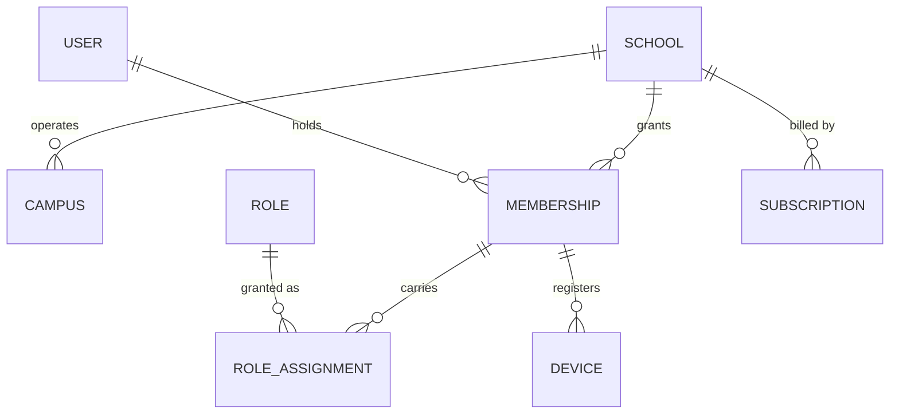
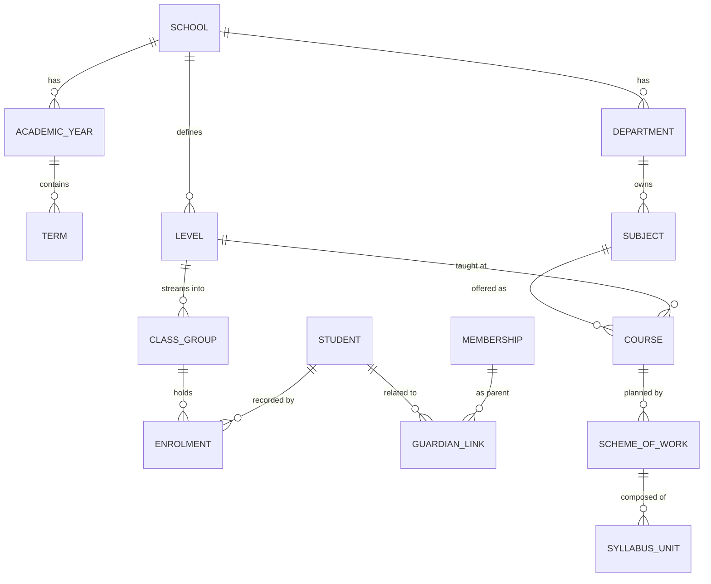
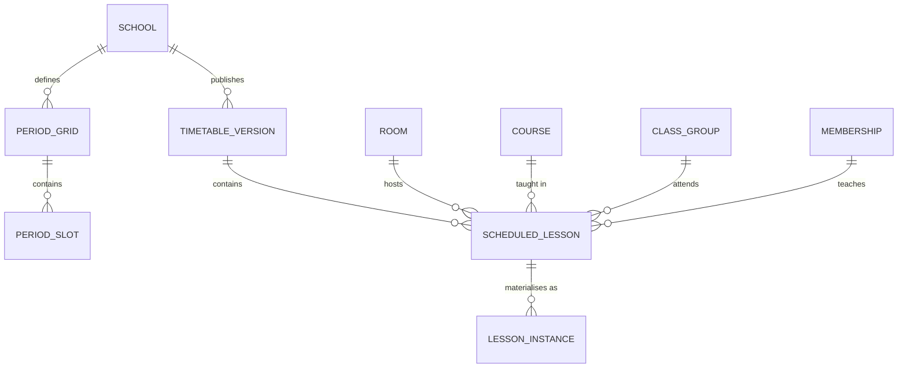
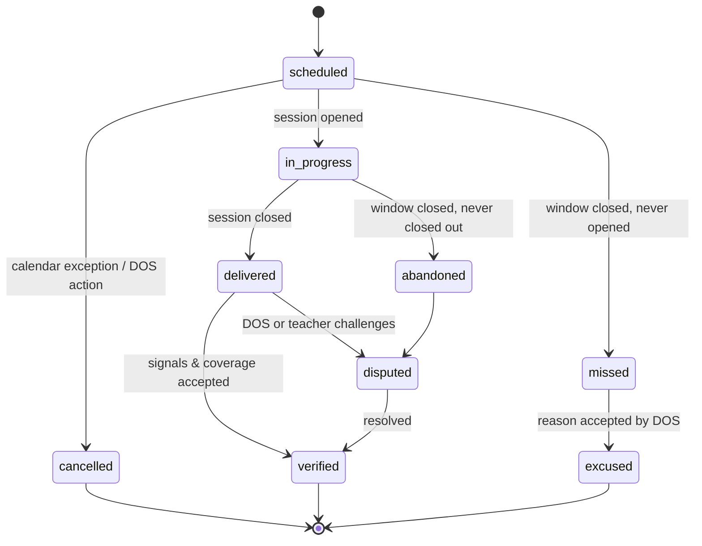
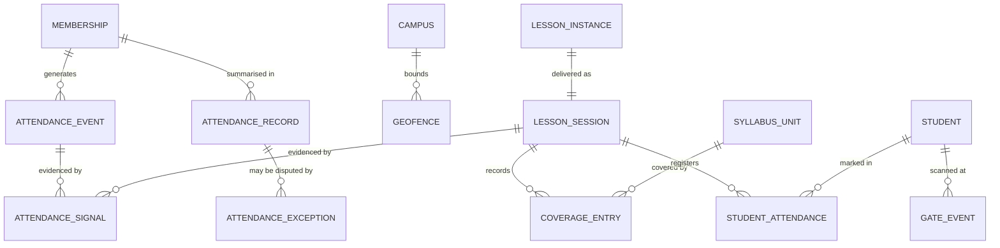
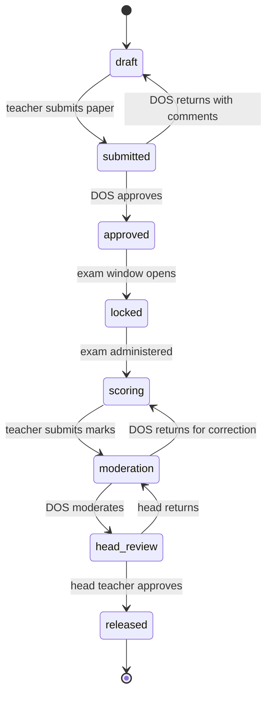

# 03 — Domain Model

Every entity below except `User`, `School`, and `Subscription` is tenant-owned:
it carries `school_id`, inherits `TenantOwnedModel`, and is covered by RLS.

Common columns on all tables: `id` (UUIDv7), `created_at`, `updated_at`,
`created_by_id`. Append-only tables have no `updated_at` and no `UPDATE` grant.

## Identity and tenancy



**`User`** — global identity. Authentication only, no school data.
`email` and `phone_e164` are globally unique; either may be the login handle.
A user is a person, not a role.

**`Membership`** — the join between a person and a school, and the only object
an API request is ever authorised against. Fields: `user_id`, `school_id`,
`staff_number`, `status` (`invited | active | suspended | ended`),
`started_on`, `ended_on`.

> A person may teach at School A and be a parent at School B. Modelling roles
> directly on `User` makes that impossible and is the most common structural
> mistake in school software. Every session is scoped to exactly one Membership;
> switching schools is an explicit re-scope, not a filter change.

**`Role`** — named permission bundle, seeded per school from platform templates
so a school can rename or extend without affecting others.
Base set: `director`, `head_teacher`, `deputy`, `dos`, `hod`, `bursar`,
`teacher`, `class_teacher`, `parent`, `student`, `ict_admin`.

**`RoleAssignment`** — grants a Role to a Membership, optionally **scoped** to an
object: HOD *of the Science department*, class teacher *of S4 Blue*.
Fields: `membership_id`, `role_id`, `scope_type`, `scope_id`, `valid_from`,
`valid_to`. Scope is what turns coarse RBAC into workable authorisation without
a policy engine.

**`Device`** — a registered mobile device bound to a Membership.
`device_fingerprint`, `platform`, `model`, `push_token`, `attested`
(Play Integrity / DeviceCheck result), `status`, `approved_by_id`.
One active device per staff Membership by default; additional devices require
approval and are recorded in the audit trail.

## Academic structure



**`AcademicYear`** / **`Term`** — `starts_on`, `ends_on`, `status`.
Terms within a year must not overlap (exclusion constraint on the date range).
Exactly one term per school may be `current`.

**`Level`** — a year of study (S1, Grade 7). **`ClassGroup`** — a stream within a
level, the persistent group students belong to.

**`Course`** — `subject × level × academic_year`, with `periods_per_week`. This
is the unit teachers are assigned to and schemes of work attach to. Modelling
timetable entries directly against Subject loses the level distinction and makes
coverage uncomputable.

**`Student`** — belongs to the school, not to a class. Identity, admission
number, `residency` (`day | boarding`), status. Class membership is `Enrolment`,
which is term-scoped, so a student repeating or transferring streams has correct
history rather than a mutated record.

**`GuardianLink`** — student ↔ parent Membership, with `relationship`,
`is_primary_contact`, `receives_notifications`, `has_portal_access`.
Separating contact from access matters: a guardian may be legally entitled to
reports while another handles day-to-day communication.

**`SchemeOfWork`** / **`SyllabusUnit`** — the plan for a Course in a Term.
Each unit has `sequence`, `title`, `planned_periods`, optional parent for
sub-topics. `planned_periods` is what makes coverage meaningful — see below.

## Timetable



**`PeriodGrid` / `PeriodSlot`** — the bell schedule: named periods with start and
end times, per day-of-week pattern. A school may run different grids for
different days.

**`TimetableVersion`** — immutable once published. `status`
(`draft | published | archived`), `effective_from`, `effective_to`.
Editing a live timetable in place destroys the meaning of every historical
"lesson missed" record, because you can no longer reconstruct what was expected
on a past date. Changes create a new version.

**`ScheduledLesson`** — the recurring template: version, day_of_week, period slot,
course, class group, teacher membership, room. No date.

**`LessonInstance`** — one scheduled lesson on one **date**. Materialised by a
nightly job for a rolling 14-day horizon, and immediately on timetable publish.
Fields: `date`, `scheduled_start_at`, `scheduled_end_at` (resolved to UTC through
the school timezone), `expected_teacher_id`, `expected_room_id`, `status`.

> The template/instance split is the backbone of the whole system. Attendance,
> coverage, substitution, cancellation, and "lesson missed" all attach to the
> instance. Without it, none of those concepts can be expressed.

**`CalendarException`** — holidays, exam days, school events. Suppresses
instance materialisation with a recorded reason, so a missing lesson on a public
holiday is explained rather than counted as a failure.

### Lesson instance lifecycle



`missed` and `abandoned` are assigned by a scheduled job after the period's grace
window, never by a user. That the *system* draws these conclusions, consistently
and without favour, is precisely the accountability the product sells.

## Presence and delivery



**`AttendanceEvent`** — append-only. `membership_id`, `kind`
(`check_in | check_out`), `captured_at` (device clock, **untrusted**),
`received_at` (server clock, authoritative), `client_event_id` (UUIDv7 from the
device, unique per school — the idempotency key), `campus_id`.

**`AttendanceSignal`** — append-only, one row per piece of evidence.
`event_id` or `session_id`, `signal_type`, `verdict`
(`pass | fail | unavailable`), `weight_applied`, `payload` (JSONB — GPS
coordinates and accuracy, SSID/BSSID hash, QR token id, device fingerprint),
`evaluated_at`.

**`AttendanceRecord`** — derived, one row per membership per date.
`status` (`present | late | partial | absent | on_leave | holiday`),
`confidence` (0–100), `first_in_at`, `last_out_at`, `minutes_on_site`,
`resolution` (`auto | reviewed | overridden`), `policy_version`.
Rebuildable from events at any time.

**`AttendanceException`** — a dispute or supervised override.
`record_id`, `raised_by_id`, `reason_code`, `narrative`, `evidence_file_id`,
`decided_by_id`, `decision`, `decided_at`. Never deletes the original record.

**`LessonSession`** — the actual delivery. `lesson_instance_id` (one-to-one),
`actual_teacher_id` (may differ from expected → substitution),
`opened_at`, `closed_at`, `room_id`, `verification_confidence`, `notes`.

**`Substitution`** — `lesson_instance_id`, `original_teacher_id`,
`substitute_teacher_id`, `reason`, `approved_by_id`. Created explicitly by the
DOS, or inferred when a different teacher opens a session and confirmed after.

**`CoverageEntry`** — `session_id`, `syllabus_unit_id`, `completion`
(`introduced | partial | completed`), `homework_set`, `resource_file_ids`.

**`StudentAttendance`** — `session_id` (per-lesson) or `date` (per-day),
`student_id`, `status` (`present | absent | late | excused | sick`),
`method` (`teacher_marked | student_scan | gate | inferred`), `marked_by_id`.

**`GateEvent`** — day-scholar arrival/departure at a campus entrance.
`student_id`, `direction`, `occurred_at`, `method` (`qr | nfc | barcode`),
`gate_id`.

### Coverage and pace — the formulas

The brief said the system "automatically calculates 35% … 81%" without defining
it. Two distinct metrics, both required, frequently confused:

**Coverage** — how much of the term's plan is done:

```
coverage = Σ planned_periods(units where completion = completed)
           ────────────────────────────────────────────────────
           Σ planned_periods(all units in the scheme for the term)
```

Weighted by planned periods, not by unit count, because a three-period unit is
not equal to a one-period unit. Only `completed` counts; `partial` does not.

**Pace** — whether that is good *for today*:

```
expected = count(LessonInstances for this course that have occurred)
           ─────────────────────────────────────────────────────────
           Σ planned_periods(all units)

pace = coverage − expected        (negative ⇒ behind)
```

Expectation counts **lesson periods that actually happened**, not calendar
days. A term with a fortnight of examinations materialises no instances for
that fortnight, so it does not silently push every class into the red.
Cancelled and excused instances are excluded for the same reason.

Both figures are computed **per class group**, not per course. A scheme is
shared by every stream taking the course, but delivery is not: S4 Blue can be
a fortnight ahead of S4 Green on the same plan, and averaging them hides
exactly the problem the dashboard exists to surface. The course-level figure
is a rollup, never the primary view.

Coverage of 35% means nothing on its own. Coverage of 35% in week 9 of 13 means
a class will not finish the syllabus, and that is the number a DOS needs on a
dashboard in week 9 — not in week 13.

## Assessment



**`AssessmentDefinition`** — course, term, `kind` (`exercise | test | midterm |
end_of_term | mock | national`), `weight`, `max_score`, `scheduled_for`, state.
**`Score`** — `assessment_id`, `student_id`, `raw_score`, `is_absent`,
`entered_by_id`. Updates write an `AuditEvent` with before/after values; a mark
change after `moderation` additionally requires a reason.
**`GradingScale` / `GradeBand`** — per school, per level. Never hard-code A–F.
**`ReportCard`** — generated per student per term from released assessments,
rendered to PDF, stored in object storage, immutable once issued. Re-issue
creates a new version with a visible revision number.

Marks are the most contested data in any school. The state machine, the audit of
every change, and the requirement that release is a head teacher's explicit act
are the point — not overhead to be optimised away.

## Communication

**`Announcement`** — author, audience selector (roles, class groups, levels,
individuals), `channels[]`, `publish_at`, `expires_at`, `requires_acknowledgement`.
**`Thread` / `Message`** — bounded conversation between defined participants
(teacher ↔ guardians of one student, staff ↔ department). Not open chat.
**`Delivery`** — one row per recipient per channel: `status`
(`queued | sent | delivered | read | failed`), `provider_message_id`,
`failed_reason`. This table is what makes "98% of parents were notified"
a defensible claim rather than an assumption, and drives SMS fallback when push
is undelivered after a threshold.

## Audit

**`AuditEvent`** — append-only, `INSERT`-only grant even for the application role.
`school_id`, `actor_membership_id`, `action`, `object_type`, `object_id`,
`before` (JSONB), `after` (JSONB), `request_id`, `ip`, `device_id`,
`occurred_at`, `prev_hash`, `hash`.

Each row's `hash = SHA-256(prev_hash ‖ canonical_json(row_without_hash))`,
chained per school. A nightly job verifies the chain and alerts on any break.
This makes silent tampering — including by us — detectable. When a school
disputes a mark change six months later, an unbroken chain is the difference
between evidence and a claim.

Retention: audit 7 years; raw signals 2 years; derived records for the life of
the tenancy plus 1 year; biometric templates deleted immediately on consent
withdrawal.

## Key invariants

Enforced by database constraint where possible, service layer where not.

1. Every tenant-owned row has a non-null `school_id`, and every FK it holds
   points at a row with the same `school_id`. Enforced with composite foreign
   keys `(school_id, id)`, not application checks.
2. Terms within an academic year do not overlap.
3. A `ScheduledLesson` may not double-book a teacher or a room within one
   published timetable version.
4. A `LessonInstance` has at most one `LessonSession`.
5. A student has at most one active `Enrolment` per term.
6. `StudentAttendance` is unique per `(session, student)` and per
   `(date, student)` for day records.
7. `AttendanceEvent.client_event_id` is unique per school — replays are absorbed.
8. A `check_out` cannot precede that day's first `check_in`.
9. Scores cannot be entered for an assessment before `locked`.
10. A released `ReportCard` is immutable; corrections create a new revision.
