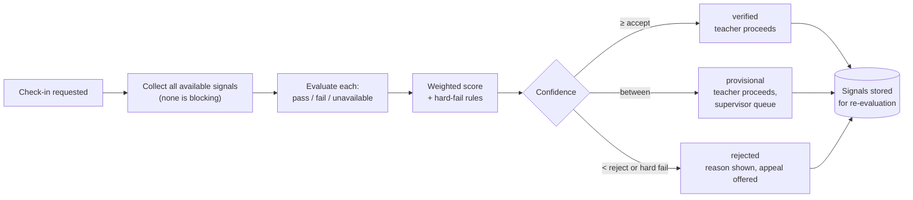
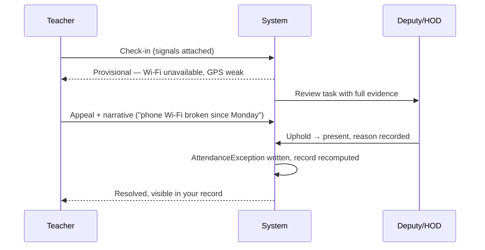

# 04 — Attendance & Verification

This is the differentiating subsystem. It is also the one most likely to fail in
the field, because it is the only part of the product that can stop a member of
staff from doing their job.

## The flaw in the layered-gate design

The original design required GPS **and** beacon **and** face **and** liveness
**and** device **and** Wi-Fi to all pass before accepting attendance.

Independent layers multiply. Assume each is generously reliable at 97% — a GPS
fix indoors under a metal roof, a mid-range Android holding a Wi-Fi association,
a face match in low morning light:

| Layers required | Success rate | Honest staff blocked per 100 check-ins |
|---|---|---|
| 1 | 97.0% | 3 |
| 3 | 91.3% | 9 |
| 6 | 83.3% | **17** |

Seventeen teachers per hundred standing at the gate unable to check in. In a
70-staff school that is a queue of twelve people at the deputy's door every
morning. Within a fortnight the school will demand a manual override, the
override will be used for everything, and the evidence chain is dead — not
because it was defeated, but because it was unusable.

The failure mode of a strict AND-gate is not fraud. It is abandonment.

## The redesign: evidence, weight, confidence

Signals are **collected**, **weighted**, and **scored**. The output is a
confidence value and a disposition, not a yes/no.



**A teacher is never blocked from teaching by a sensor.** Low confidence creates
a review task for a human, and the teacher's morning continues. The system's
job is to make dishonesty visible and effortful, not to be a lock.

## Signal catalogue

| Signal | Weight | Spoof resistance | Availability | Notes |
|---|---:|---|---|---|
| **Rotating QR** at gate/staff room | 35 | High | High | Server-signed, 30 s TTL, single-use per staff per window. The workhorse. |
| **Device binding** | 25 | Medium-high | Very high | Registered device + platform attestation (Play Integrity / DeviceCheck) |
| **Geofence** | 15 | Low-medium | Medium | Campus polygon, not a radius. Accuracy-aware — see below |
| **School Wi-Fi** | 10 | Medium | Medium | BSSID hash match. Not SSID: SSIDs are trivially cloned |
| **Time window** | 10 | n/a | Total | Within the person's rostered duty window |
| **BLE beacon** | 15 | High | Low | Optional hardware. Only where a school buys beacons |
| **Face match** | 0–20 | Medium | Medium | Opt-in only, never sole determinant — [ADR-0004](adr/0004-biometrics-opt-in.md) |

Weights are **per-school policy**, versioned. A rural school with no Wi-Fi and no
beacons runs QR + device + time and reaches accept comfortably. A well-equipped
urban school raises the bar. The same code serves both because the policy is
data, not branching logic.

### Handling `unavailable` correctly

An unavailable signal is **not** a failed signal. GPS that never returns a fix is
missing evidence, not counter-evidence. Score over the signals actually obtained:

```
confidence = 100 × Σ weight(s) for s where verdict = pass
                   ──────────────────────────────────────
                   Σ weight(s) for s where verdict ≠ unavailable
```

with a floor: if the *available* weight is under `min_evidence_weight` (default
40), the result is `provisional` regardless of score. A perfect score from one
weak signal is not strong evidence, and this is where a naïve ratio would happily
report 100%.

### Hard-fail rules

Independent of score, these force `rejected`:

1. Device is not registered to this Membership, or attestation failed.
2. QR token expired, already consumed, or issued for a different campus.
3. Geofence verdict is `fail` **with reported accuracy under 50 m** — a confident
   fix, confidently outside. A 500 m-accuracy fix outside the fence is
   `unavailable`, not `fail`; treating vague fixes as proof of absence generates
   false accusations, and false accusations are what destroy trust in the tool.
4. Device clock skew from server exceeds 5 minutes with a mocked-location flag.
5. Duplicate `client_event_id` with different signal content — replay attempt.

Each rejection stores the triggering rule and is shown to the teacher in plain
language. "Check-in rejected" with no reason is how you get a staff revolt.

## Thresholds and disposition

| Confidence | Disposition | Effect |
|---|---|---|
| ≥ 75 | `verified` | Recorded, no human involvement |
| 45–74 | `provisional` | Recorded, appears in supervisor queue, resolves within 24 h |
| < 45 or hard fail | `rejected` | Not recorded as presence; teacher may appeal immediately |

Defaults. Each school may tune within platform-enforced bounds — a school cannot
set the accept threshold below 40, because a product that certifies anything as
verified is worth nothing.

## Lesson delivery verification

Presence at school is the weak claim. Presence *in the lesson* is the valuable one.

The teacher opens a session by scanning the **classroom's rotating QR**. The
server validates, in this order:

1. Token is valid, unexpired, and bound to that room.
2. A `LessonInstance` exists for this teacher, this room, at this time
   (±`grace_minutes`, default 10).
3. If the teacher is not the expected teacher → substitution flow.
4. If the room differs from the expected room → accepted, flagged as a room
   change, DOS notified. **Not rejected.** Rooms change constantly for real,
   ordinary reasons, and rejecting the scan just means the lesson goes unrecorded.

Closing the session requires a coverage entry: which syllabus units were touched
and to what degree. This is the moment coverage data is captured, and it is the
only mandatory data entry in the teacher's day — roughly two taps if the plan is
being followed in sequence, because the app pre-selects the next planned unit.

A `LessonInstance` never opened, past its grace window, is marked `missed` by a
scheduled job. Missed lessons are what the DOS dashboard leads with.

## Student attendance

Default-present with tap-absent. Marking 40 present individually is the reason
paper registers survive; marking 3 absent takes eight seconds.

| Context | Method |
|---|---|
| Lesson register | Teacher opens session → roster pre-marked present → tap absentees |
| Day scholars | QR/NFC/barcode at the gate on arrival and departure |
| Boarders | Morning roll call by class teacher; evening roll by house |
| Exams | Explicit per-candidate marking, no defaults |

Gate events and lesson registers are reconciled nightly. A student scanned in at
the gate but absent from three consecutive lessons is a signal worth surfacing —
that is a child on campus and not in class, which matters more than the
attendance percentage.

Guardians of absent students are notified after the configured lesson threshold
(default: absent from first lesson, notify by 09:30), never per-lesson — parents
who receive six notifications a day stop reading them.

## The appeal and review loop



Every teacher can see their complete attendance history and the evidence behind
each record. Rights are symmetric by design: a system that measures people
without letting them see or contest the measurements gets treated as an enemy,
and staff are extremely good at defeating systems they regard as enemies.

Two metrics govern the subsystem's own health, reviewed monthly:

- **Provisional rate.** Above 10% means thresholds or weights are miscalibrated
  for that school, not that the staff are dishonest.
- **Appeal upheld rate.** Above 2% means the model is producing false
  accusations. Recalibrate before anyone is disciplined on this data.

## Anti-fraud measures that actually pay

Ranked by value per unit of effort and cost:

1. **Rotating server-signed QR** — defeats photograph-and-reuse, which is the
   dominant real-world attack. Cheap: a tablet or printed e-ink display.
2. **Device binding with attestation** — defeats "check me in from home", the
   second attack. Free.
3. **Pattern detection** — same device fingerprint checking in multiple staff,
   check-ins clustered in an implausible burst, a teacher whose GPS is always
   exactly at the fence edge. Runs nightly, flags for human review, accuses no one.
4. **Check-out enforcement** — a day with no check-out is `partial`, not
   `present`. Catches sign-in-and-leave without any additional hardware.
5. Beacons and face recognition — real but expensive, and worth adding only once
   1–4 are in place and a specific school still has a specific problem.

The first four cost almost nothing and cover the overwhelming majority of actual
fraud. Starting with face recognition is starting at the expensive end of the
list with the highest legal exposure and the worst failure modes.
